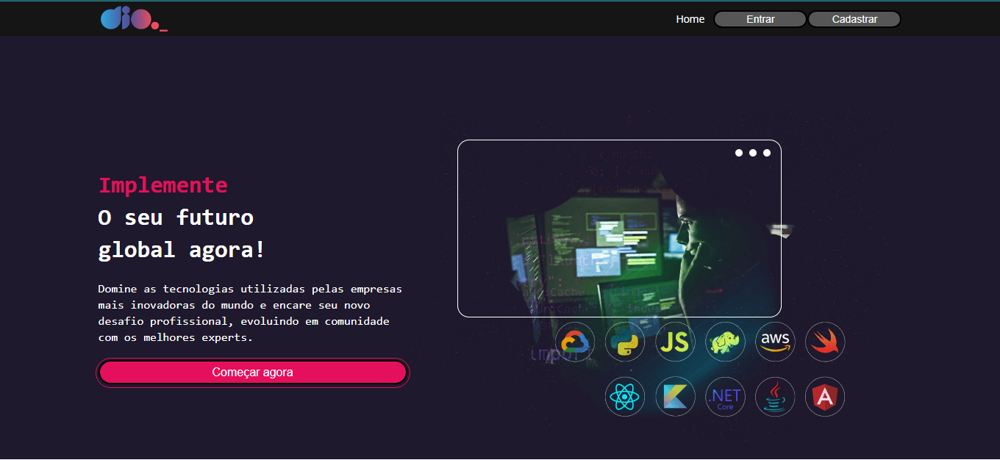

# Dio_clone

## :rocket:   Sobre o projeto

Clone da plataforma Dio. Possui as seguintes telas:

-   Home
-   Login
-   Cadastro
-  Feed

Foi utilizado React CLI, Estilização com styled-components, Hooks e Formulários.

## :computer:  Tecnologias usadas:

-   `Javascript`
-   `HTML`
-   `CSS`
-   `React`

## :tv: Telas

### Home

### Login

### Cadastro

### Feed
